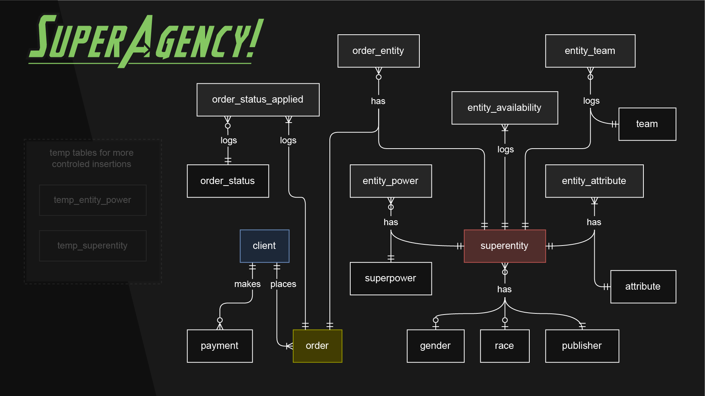

# Design Document

By Damián Ferrero and Eva Nikoghosyan

Video overview: <https://youtu.be/1UwL4qk3mec>

## Scope

This is the database of SuperAgency!, a company that manages the hiring of superheroes and supervillains (referred to as 'superentities') worldwide.


## Functional Requirements

**The database operator should be able to:**
- Record `clients`.
- Record client `orders`.
- Filter `superentities` by various criteria to identify those explicitly requested by clients or deemed suitable by the company for a given order.
- Assign `superentities` to orders.
- Record client `payments`.
- Record the `statuses` of orders.
- Add new `superentities`, log their availability, and track their availability status.
- Add new `teams`, manage superentities' memberships, and log their association with or departure from these teams.
- Assign each superentity a `gender`, `race`, and `publisher`, while creating new entries in these categories when necessary.
- Assign each superentity a `morality_rating`.
  > **Note:** The values in this column were determined using ChatGPT with a prompt to imagine how the general public would rate each registered superentity's morality on a scale of 1 to 10. This feature can aid in filtering candidates for orders and matching them to tasks based on the assumed morality of required actions. In reality, it would make more sense for superentities to decide which tasks to undertake. This column was added as an SQL practice exercise.
- Modify any value in the database if needed (modifications are not a standard part of the workflow).
- Delete records if necessary (although deletions are rare in the primary workflow; logging changes for both superentity availability `status` and team `membership` should be preferred).


## Representation

### Entities
We chose the following entities to ensure that the SuperAgency has a robust and detailed SQLite database, capable of satisfying the diverse requests of clients as effectively as possible.

> For an explanation of most constraints and data types applied, see the [next section](#frequent-constraints).

*(Click to unfold schemas):*

<details>
  <summary> <code>client</code> </summary>

  ```sql
  CREATE TABLE IF NOT EXISTS "client" (
      "id" INTEGER PRIMARY KEY,
      "first_name" TEXT COLLATE NOCASE NOT NULL,
      "last_name" TEXT COLLATE NOCASE NOT NULL,
      "phone" TEXT COLLATE NOCASE NOT NULL UNIQUE,
      "note" TEXT COLLATE NOCASE DEFAULT NULL
  );
  ```
</details>

<details>
  <summary> <code>order</code> </summary>

  ```sql
  CREATE TABLE "order" (
      "id" INTEGER PRIMARY KEY NOT NULL,
      "client_id" INTEGER NOT NULL,
      "created_at" DATETIME NOT NULL DEFAULT CURRENT_TIMESTAMP,
      "title" TEXT COLLATE NOCASE NOT NULL,
      "location" TEXT COLLATE NOCASE NOT NULL,
      "description" TEXT COLLATE NOCASE NOT NULL,
      "scheduled_start" DATETIME NOT NULL,
      "scheduled_end" DATETIME DEFAULT NULL,
      "fixed_price" INTEGER DEFAULT NULL,
      CHECK ("scheduled_end" IS NULL OR "scheduled_end" >= "scheduled_start"),
      CONSTRAINT fk_order_client FOREIGN KEY ("client_id") REFERENCES "client"("id") ON DELETE CASCADE
  );
  ```
</details>

<details>
  <summary> <code>payment</code> </summary>

  ```sql
  CREATE TABLE "payment" (
      "id" INTEGER PRIMARY KEY NOT NULL,
      "datetime" DATETIME NOT NULL DEFAULT CURRENT_TIMESTAMP,
      "client_id" INTEGER NOT NULL,
      "amount" INTEGER NOT NULL,
      CONSTRAINT fk_pay_client FOREIGN KEY ("client_id") REFERENCES "client"("id") ON DELETE CASCADE
  );
  ```
</details>

<details>
  <summary> <code>superentity</code> </summary>

  ```sql
  CREATE TABLE "superentity" (
      "id" INTEGER PRIMARY KEY NOT NULL,
      "known_as" TEXT COLLATE NOCASE NOT NULL,
      "full_name" TEXT COLLATE NOCASE NOT NULL DEFAULT '-',
      "gender_id" INTEGER DEFAULT NULL,
      "race_id" INTEGER DEFAULT NULL,
      "publisher_id" INTEGER NOT NULL DEFAULT 1,
      "morality_rating" INTEGER CHECK ("morality_rating" BETWEEN 1 AND 10) DEFAULT NULL,
      UNIQUE ("known_as", "full_name", "publisher_id"),
      CONSTRAINT fk_sup_gen FOREIGN KEY ("gender_id") REFERENCES "gender"("id"),
      CONSTRAINT fk_sup_pub FOREIGN KEY ("publisher_id") REFERENCES "publisher"("id"),
      CONSTRAINT fk_sup_race FOREIGN KEY ("race_id") REFERENCES "race"("id")
  );
  ```
</details>

<details>
  <summary> <code>team</code> </summary>

  ```sql
  CREATE TABLE IF NOT EXISTS "team" (
    "id" INTEGER PRIMARY KEY,
    "name" TEXT COLLATE NOCASE NOT NULL UNIQUE
  );
  ```
</details>

<details>
  <summary> <code>attribute</code> </summary>

  ```sql
  CREATE TABLE IF NOT EXISTS "attribute" (
    "id" INTEGER PRIMARY KEY,
    "name" TEXT COLLATE NOCASE DEFAULT NULL UNIQUE
  );
  ```
</details>

<details>
  <summary> <code>superpower</code> </summary>

  ```sql
  CREATE TABLE IF NOT EXISTS "superpower" (
    "id" INTEGER PRIMARY KEY,
    "name" TEXT COLLATE NOCASE NOT NULL UNIQUE
  );
  ```
</details>

<details>
  <summary> <code>gender</code> </summary>

  ```sql
  CREATE TABLE IF NOT EXISTS "gender" (
    "id" INTEGER PRIMARY KEY,
    "name" TEXT COLLATE NOCASE NOT NULL UNIQUE
  );
  ```
</details>

<details>
  <summary> <code>race</code> </summary>

  ```sql
  CREATE TABLE IF NOT EXISTS "race" (
    "id" INTEGER PRIMARY KEY,
    "name" TEXT COLLATE NOCASE DEFAULT NULL UNIQUE
  );
  ```
</details>

<details>
  <summary> <code>publisher</code> </summary>

  ```sql
  CREATE TABLE IF NOT EXISTS "publisher" (
    "id" INTEGER PRIMARY KEY,
    "name" TEXT COLLATE NOCASE DEFAULT NULL UNIQUE
  );
  ```
</details>


### FREQUENT-CONSTRAINTS
Most frequent constraints in these entities and the general reasons why those constraints were used:

##### INTEGER:
- The only **numeric data type** of the whole database. Applied to the columns where integers numbers are needed, such as IDs, financial values, attribute values (amount of each attribute) and morality rating.

##### TEXT:
- **Data type** applied to the columns where text best serve to identify a record, such as names, notes, and labels.

##### DATETIME:
- **Data type** used to store both date and time information in the format `YYYY-MM-DD HH:MM:SS`. Applied to columns that require timestamps for scheduling tasks, logging events, and tracking activities. Sometimes it also includes a `DEFAULT CURRENT_TIMESTAMP` constraint, which applies the current timestamp by default when no other value is provided for the column.

##### NOT NULL
- **Data integrity**: Ensures every record of the column has a value, preventing missing or undefined data. Applied to columns where a `NULL` value would be inconvenient, generally due to the increased vagueness it could introduce to the record.

##### DEFAULT
- Assigns a default value for each insertion when no value is explicitly provided.

##### NULL
- **Flexibility**: Allows fields to remain empty if no value is available. Applied to the columns where a value is not strictly required even if it would be better if they had it (e.g., `gender_id` or `race_id` in `superentity` table).
- **Optional data**: Enables storing information only when necessary or convenient, reducing the storage of unused data (e.g., `note` in `client` table).
- **Clear distinction**: Differentiates between "unknown" or "not applicable" and actual empty strings or zero values.

##### UNIQUE
- **Prevents duplicates:** Ensures all values in the column (or set of columns) are distinct (e.g., there can't be more than one client with the same phone number, or more than one superentity with the same combination of `known_as`, `full_name` and `publisher_id`).
- **Indexing efficiency:** Automatically creates a unique index, improving query performance for lookups.

##### COLLATE NOCASE
- **Case-insensitive comparisons:** Enables text comparisons to ignore case differences (e.g., "batman" equals "BATMAN"), except in queries or statements that use string-modifying functions (e.g., `TRIM()`, `REPLACE()`, `SUBSTR()`), concatenations (e.g., `CONCAT()` or `||`), or other operations that override the collation behavior. In such cases, comparisons default to case-sensitive (`COLLATE CASE`). To restore case-insensitivity, `COLLATE NOCASE` must be explicitly specified.

##### CHECK()
- Ensures that only values meeting a **specific condition** are allowed in the column.


### Relationships



#### Short description
A `client` places 1 to many `orders` and makes 0 to many `payments` to hire 1 or many `superentities` (individually or as `teams`) with different `attributes`, `superpowers`, `genders`, `races`, and `publishers`.
> The actual table names, as shown before, are exactly those but in singular (e.g., `client` instead of `clients`).

#### Long description
* The `client` can place 1 to many `orders` and make 0 to many `payments` (if 0, the order isn't executed).
* All possible statuses of any order are stored in the `order_status` table.
* As soon as an order is placed, a trigger logs the order ID in the `order_status_applied` junction table along with the `order_status` ID of "sa_to_confirm" (meaning "SuperAgency to confirm") and the `CURRENT_TIMESTAMP`. When an order changes its status, the user must log this change along with the new status and the `CURRENT_TIMESTAMP` in the same table. Therefore:
  - Each record in `order_status_applied` has 1 and only 1 `order` ID and 1 and only 1 `order_status` ID.
  - Each `order` ID is logged there 1 to many times.
  - Each `order_status` ID is logged there 0 to many times.

* The superentities are assigned to execute orders in the `order_entity` junction table. Initially, one or more `superentities` are added as candidates to execute the order. The agency and the client then evaluate the candidates until, in the best-case scenario, they agree on assigning the order to the entity or entities ultimately responsible for its execution. Therefore:
  - Each record in `order_entity` has 1 and only 1 `order` ID and 1 and only 1 `superentity` ID.
  - Each order and each superentity can appear 0 to many times in the `order_entity` junction table.

* Each `superentity` has 0 to 1 `gender`, 0 to 1 `race`, and 1 and only 1 `publisher`. The `publisher_id` is part of a UNIQUE constraint (along with the `known_as` and `full_name` columns) to account for superentities from different publishers sharing the same names.
  - Any `gender`, `race`, or `publisher` can appear 0 to many times in the `superentity` table.

* Each superpower is recorded in the `superpower` table. Each superentity is linked to its superpowers through the `entity_power` junction table.
  - Each record in `entity_power` has 1 and only 1 `superentity` and 1 and only 1 `superpower`.
  - Each superentity can be logged 0 to many times in `entity_power`, just as each `superpower` can.

* There are also 6 fixed attributes in the `attribute` table. Superentities are linked to them in the `entity_attribute` junction table.
  - Each record in `entity_attribute` has 1 and only 1 `superentity` and 1 and only 1 `attribute`.
  - Each `superentity` is recorded 6 times in `entity_attribute`, one per `attribute`.
  - Each `attribute` is recorded in `entity_attribute` the same number of times as there are superentities in the database.
  > It would be ideal to enforce this dynamic at the application level when adding new superentities. For now, it only represents the correct manual use of this database.

* The relationships between the superentities and the teams are established in the `entity_team` junction table.
  - Each of its records has 1 and only 1 `superentity`, 1 and only 1 `team`, a `member` value (`in` or `out`) and a `DATETIME` (`CURRENT_TIMESTAMP` by default). This way, a chronological history of each team membership is recorded.
  - Each `team` and each `superentity` can be logged in `entity_team` 0 to many times.

## Optimizations

### Indexes

Apart from the indexes automatically created by SQLite based on our schema (e.g., on `PRIMARY KEY` columns or `UNIQUE` constraints), 17 additional indexes were created.  While these indexes may slow down the database's writing processes, they significantly speed up the reading processes.  The tradeoff seems worthwhile to us because we think this database would handle more reading than writing. The explicitly created indexes are:


```sql
-- Frequently searched columns in lookup tables
"idx_attribute_name" ON "attribute"("name");
"idx_gender_name" ON "gender"("name");
"idx_publisher_name" ON "publisher"("name");
"idx_race_name" ON "race"("name");
"idx_superpower_name" ON "superpower"("name");
"idx_team_name" ON "team"("name");

-- Frequently searched columns in "superentity" table
"idx_superentity_known_as" ON "superentity"("known_as");
"idx_superentity_full_name" ON "superentity"("full_name");

-- Potentially most searched columns in the "order" table
"idx_order_client_id" ON "order"("client_id");

-- Junction table indexes
"idx_order_entity_order_id" ON "order_entity"("order_id");
"idx_order_entity_entity_id" ON "order_entity"("entity_id");
"idx_entity_team_entity_id" ON "entity_team"("entity_id");
"idx_entity_team_team_id" ON "entity_team"("team_id");
"idx_entity_attribute_entity_id" ON "entity_attribute"("entity_id");
"idx_entity_attribute_attribute_id" ON "entity_attribute"("attribute_id");
"idx_entity_power_entity_id" ON "entity_power"("entity_id");
"idx_entity_power_power_id" ON "entity_power"("power_id");
```

### Views

This database has several views. Those that include the word "readable" in their name offer greater readability of the data, including the names or labels corresponding to the different foreign keys. Some of the views have an additional purpose of facilitating some writing processes via triggers ([see next section](#triggers)). Some of the views also include columns with specific purposes, which we will clarify in each case.


The views are:
- `superentity_readable`
    - It includes the `status` column, which represents the availability of that entity.
- `order_readable`
    - It also shows the current status of the order and the time when it was assigned that status.
- `entity_attribute_readable`
- `entity_power_readable`
- `order_entity_readable`
- `entity_team_readable`
    - It also shows the availability of that entity and whether it currently belongs to that team.
- `punctuality`
    - Apart from showing the current status of the order, it compares the scheduled start and end datetimes with the actual start and end datetimes. This can be useful for evaluating the punctuality of the superentities responsible for each order, as well as the company as a whole, to assess when improvements are needed in that area.
- `client_full`
    - It visualizes clients' personal data, general payment information, and the last order datetime. This could be useful, among other things, for implementing potential benefits for clients based on various criteria.


### Triggers

We created these triggers:

- `order_after_insert_insert_order_status`
    > After inserting into the `order` table, it assigns the status "sa_to_confirm" (meaning that SuperAgency! has to confirm the order) by inserting that relationship into the `order_status_applied` table.

These 3 triggers insert into a specific table when trying to insert into a specific view. They handle different input scenarios and insert the records for the missing foreign keys:
- `superentity_r_instead_insert_insert_superentity`
    > When trying to insert into the `superentity_readable` view, it inserts into the `superentity` table instead.
- `ent_pow_r_instead_insert_insert_ent_pow`
    > When trying to insert into the `entity_power_readable` view, it inserts into the `entity_power` table instead.
- `ent_team_r_instead_insert_insert_ent_team`
    > When trying to insert into the `entity_team_readable` view, it inserts into the `entity_team` table instead.


## Limitations

- Apart from the `superentities`, it does not include the management of any member of the company.
- Apart from the `order`'s fees and `client`'s `payments`, it does not include the handling of data related to other financial transactions that the company would surely have.
- It only has `fixed_price` for the `orders`. It would be better if it had other options too, like daily, weekly, monthly, and annual. Also, other categories like payment method, installments, interest, discounts, etc.
- The `order.location` would be better represented with an exclusive table and foreign keys referencing its IDs.
- It may be better to adapt the database into a platform where clients could post orders into a shared pool, and superentities could browse, filter, and accept tasks that match their skills and preferences. It may include profiles, secure communication, matching algorithms, and feedback systems to streamline connections and ensure transparency.
- Every `superentity` must have a value for each of the 6 fixed `attributes`. It would be better to implement a `superentity` insertion mechanism that requires this.
- The current availability of superentities refers only to whether or not they are generally operational for the company. Although the current data can also be used to filter availability in relation to the dates and times of the orders to which the various superentities are assigned, it would be more useful to provide this functionality in some view and/or at the application level.


